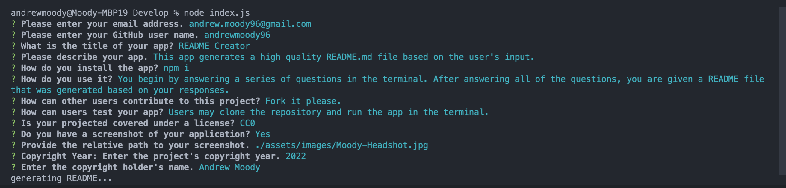

# README Creator   
---

## Description

This app generates a high quality README.md file based on a user's responses to questions.

---
## Table of Contents

- [Installation](#installation)
- [Usage](#usage)
- [Contributing](#contributing)
- [Testing](#testing)
- [Questions](#questions)
- [License](#license)

---
## Installation

There are no special install instructions currently. You will need to use the app locally by running 'node index.js' in your terminal.

---
## Usage

You will be presented with a series of questions. After you have answered all of the questions, you will receive a README file. The file is created in the same folder as 'index.js' and will contain content that matches your input.

[Screen Recording](https://drive.google.com/file/d/1qQtnZG5ZzKv7wuNTDW7J2t8pSIiGJGM5/view?usp=sharing)

---
## Contributing

Please fork the project to continue development.

---
## Testing

Clone the repo and run the application in your terminal. If you encounter bugs, please contact me.

---
## Questions

If you have any questions, please send an email to <andrew.moody96@gmail.com>, or check out my [GitHub](https://github.com/andrewmoody96).

---
### Copyright 2022, Andrew Moody 
  #### License
  
   
  [CC0](https://creativecommons.org/publicdomain/zero/1.0/legalcode)